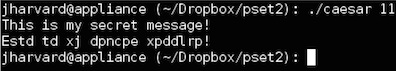
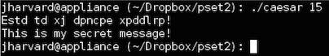

Caesar
======

caesar.c is a program I created for CS50 offered via EdX. It takes an positive integer as the second command line argument. Then it encrypts the string a user typed in the next command line by shifting the ascii using the command line argument. For example, one can type in the key integer '11' and type in 'This is my secret message!' in the next command line. The program should output encrypted message as follows:  
  
That is, one can use this program to dicipher a coded message as long as they share the key integer. Because this program wraps around the alphabetic letters when they reach 'z' or 'Z' back to 'a' or 'A,' one can easily dicipher the coded message by typing the dicipher code '15.' (26-11)  
  

